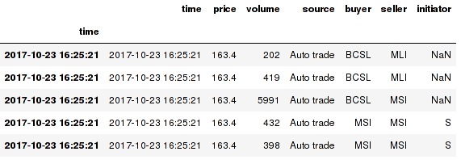
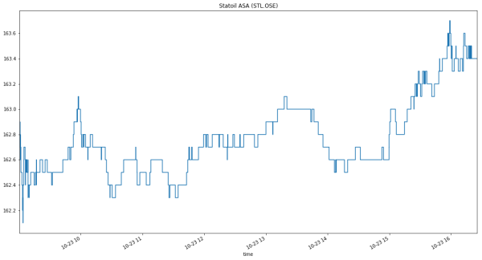
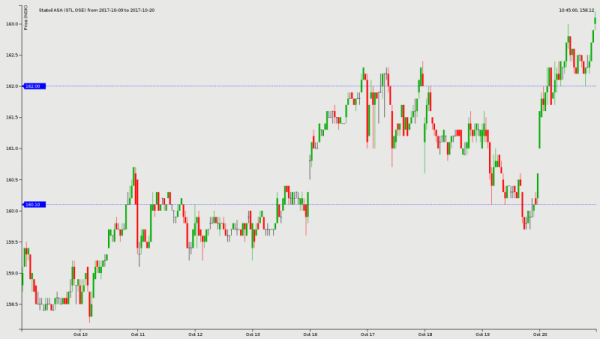

# ntfdl
 A python Netfonds data downloader and processor based on Pandas.

 ```
 from ntfdl import dl
 stl = dl('STL', exchange='OSE', download=True)
 stl.trades.tail()
 ```
 
```
stl.trades.price.plot(drawstyle='steps')
plt.title("Statoil ASA (STL.OSE)")
```


 The norwegian broker Netfonds ASA kindly makes 15 minute delayed intraday data (up to 20 days) as well as historical data available freely as csv files.

 This package uses Pandas for most of the retrival and processing. And most of the data returned are as Pandas dataframe.

 Author is not connected or affiliated with Netfonds ASA.

 Supports:
 - intraday trades and optional vwap
 - intraday positions (orderbook)
 - resampling intraday trades to ohlcv with custom resampling window and optional moving averages
 - merging multiple days of intraday data (trades, positions or trades resampled as ohlcv)
 - retrieving news for instrument
 - retrieving info for instrument

## Examples

### Jupyter Notebooks

Since ntfdl returns data as Pandas dataframes, it's easy to use the package in notebooks. Using Matplotlib makes it easy to plot the data.

See [examples/notebooks/](examples/notebooks/) for some examples

### Techan.js
Using the D3.js based financial charting library Techan.js with static csv files generated by ntfdl is easy using Pandas `DataFrame.to_csv('<filename.csv>')` on the returned dataframe.

see [examples/techan.js/](examples/techan.js/)



## Contributing
Found a bug? Create an issue!

Contribute code by forking the repo and submit PR's


## Package ntfdl

### ntfdl.dl

### ntfdl.multi

### ntfdl.news

### ntfdl.info
Note: Naive implementation and will not work for exchanges except OSE, OAX and Merkur (Norwegian Stock Exchange marketplaces)

